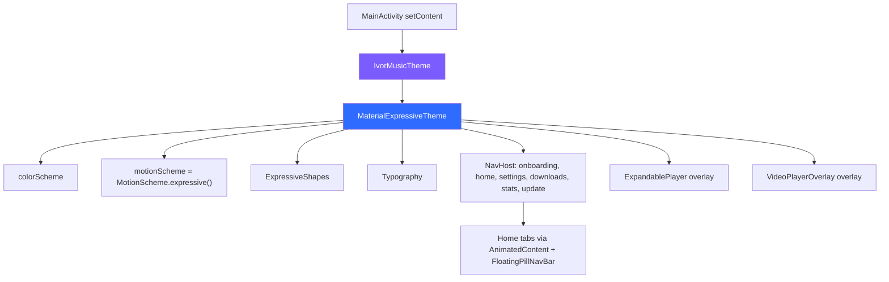
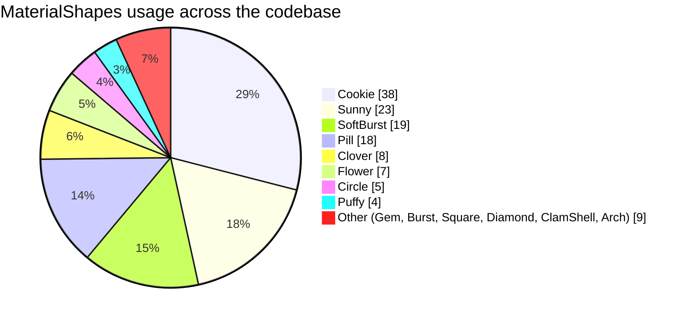
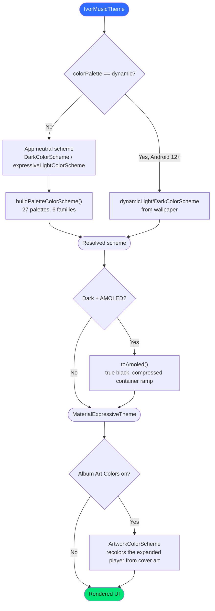

<h1 align="center">Koda Design</h1>

<p align="center">
  <b>Why Koda looks the way it does, and why that is not a setting</b>
</p>

---

## The short version

Koda is not a music app that happens to use Material 3 Expressive. It is a music app **built on** Material 3 Expressive, from the theme entry point outward. The design language is not a skin layered over a neutral app. It is the construction material. Shapes, motion, color, and typography are all resolved through the Expressive system, and the app's screens are composed from Expressive primitives rather than hand-rolled equivalents.

That distinction matters when someone asks for "a different UI". Changing the look of Koda is not a theme swap. It is a rewrite of every screen.

---

## What "built ground-up" actually means

These are counts from the current source tree, not aspirations.

| Measure | Value |
|---|---|
| UI Kotlin files | 63 |
| Lines of UI code | ~37,500 |
| Files importing `androidx.compose.material3` | 53 |
| Files using Expressive-only APIs | 39 |
| `MaterialShapes` references | 131, across 14 distinct shapes |
| `spring()` animation specs | 97, across 28 files |
| `animate*AsState` call sites | 104 |
| Built-in color palettes | 27, in 6 families |
| Player styles | 8, each a full independent layout |
| Material 3 version | `1.5.0-alpha13` (Expressive APIs) |

There is no fallback path, no "classic mode", and no abstraction layer between the app and Material 3. `ExperimentalMaterial3ExpressiveApi` is opted into **globally** at the compiler level in `app/build.gradle.kts`, because the Expressive surface is used widely enough that per-file annotations would be noise:

```kotlin
freeCompilerArgs += listOf(
    "-opt-in=androidx.compose.material3.ExperimentalMaterial3ExpressiveApi",
    "-opt-in=androidx.compose.material3.ExperimentalMaterial3Api"
)
```

---

## The theme is the root of the app

Every composable in Koda renders inside a single `MaterialExpressiveTheme` in `ui/theme/Theme.kt`. Color scheme, motion scheme, shape scale, and typography are all injected there. Nothing downstream defines its own design system.

```kotlin
MaterialExpressiveTheme(
    colorScheme = colorScheme,
    motionScheme = MotionScheme.expressive(),
    shapes = ExpressiveShapes,
    typography = Typography,
    content = content
)
```



Because the theme sits above the `NavHost` **and** above both player overlays, there is no part of the app that escapes it, including the music player and the video player, which live outside the navigation graph.

---

## Shape

Material 3 Expressive ships a shape library, and Koda leans on it hard rather than drawing its own polygons. 131 references across 14 shapes, with a deliberate bias toward a handful that define the app's visual signature.



On top of that, the shape scale itself is pushed rounder than stock Material 3, which is a large part of why Koda reads as "soft" at a glance:

```kotlin
private val ExpressiveShapes = Shapes(
    extraSmall = RoundedCornerShape(8.dp),
    small      = RoundedCornerShape(12.dp),
    medium     = RoundedCornerShape(20.dp),
    large      = RoundedCornerShape(28.dp),
    extraLarge = RoundedCornerShape(36.dp)
)
```

Seven files go further and animate between shapes at runtime using `RoundedPolygon` / `Morph`. The onboarding hero, the Morph player's living cover art, the Dial player's tick ring, the style wheel, and the settings and home headers.

---

## Motion

Expressive motion is spring-physics motion. Koda uses `spring()` 97 times across 28 files, and the distribution of damping ratios is itself a design statement: bouncy is the default, not the exception.

| Spring constant | Uses |
|---|---|
| `DampingRatioMediumBouncy` | 63 |
| `StiffnessLow` | 28 |
| `StiffnessMediumLow` | 14 |
| `StiffnessMedium` | 14 |
| `DampingRatioNoBouncy` | 13 |
| `DampingRatioLowBouncy` | 2 |

Duration-based `tween()` still appears 63 times, but it is reserved for things springs genuinely model badly. Crossfades, timed reveals, and progress that must track real elapsed time. Anything responding to a touch is a spring.

Expressive progress and loading indicators are used in place of the standard ones throughout: `LoadingIndicator` in 26 files, `ContainedLoadingIndicator` in 5, `LinearWavyProgressIndicator` in 9, and `CircularWavyProgressIndicator` in 4.

Motion is paired with restraint on haptics. `PlayerHaptics` deliberately fires on only two interactions (skip, and play/pause), using semantic feedback types rather than raw vibration:

```kotlin
fun skip() = haptics.performHapticFeedback(HapticFeedbackType.Confirm)

fun playPause(nowPlaying: Boolean) = haptics.performHapticFeedback(
    if (nowPlaying) HapticFeedbackType.ToggleOn else HapticFeedbackType.ToggleOff
)
```

Everything else stays silent on purpose. Haptics that fire on every tap stop meaning anything.

---

## Color

Koda's color system has three independent inputs that resolve into one `ColorScheme`. This is where most of the app's visual variety actually lives.



The palette families are chosen to cover genuinely different moods rather than to pad a list:

| Family | Palettes |
|---|---|
| Vibrant | Electric, Magenta Pop, Citrus, Neon Lime |
| Pastel | Lavender Haze, Cotton Mint, Peach Sorbet, Baby Sky |
| Aesthetic | Vintage Film, Dusty Rose, Sage & Sand, Faded Denim, Oat Latte, Sun-bleached |
| Earthy | Terracotta, Forest, Mocha, Autumn |
| Moody | Crimson Noir, Midnight Indigo, Deep Teal, Royal Plum |
| Jewel & Mono | Emerald, Ocean, Rose Gold, Graphite |

Each palette is three seed colors expanded into full Material role sets (`primary`, `onPrimary`, `primaryContainer`, and so on for secondary and tertiary) via HSL manipulation in `ColorPalettes.kt`. Picking a fixed palette **fully ignores** wallpaper color rather than blending with it, so the result is predictable.

AMOLED mode does not simply set the background to black. It compresses the whole `surfaceContainer` ramp toward black so cards keep elevation separation instead of turning into a grey wash on an OLED panel.

---

## Typography

Two families, each doing a specific job:

- **Roboto Flex:** the variable-axis workhorse. Body and label styles run at width 100, while `headlineSmall` uses a width-110 / weight-600 variant so section headers hold a tighter column without switching family.
- **Montserrat:** loaded through the Google Fonts provider across seven weights, and applied to `displayLarge`: 68sp SemiBold, stretched to `scaleX = 1.5f` with `-0.05em` tracking and an `0.8em` line height. That single style is what gives the app's big headers their poster-like presence.

---

## Eight players, one design language

The player styles are the clearest demonstration that Expressive is a construction material rather than a coat of paint. Each is an independent layout (roughly 10,300 lines across the player package), and none of them re-implements theming, motion, or shape. They all draw from the same system.

| Style | Idea |
|---|---|
| Classic | Familiar transport, play / pause / next / previous |
| Gesture | Swipeable carousel flicked between tracks |
| Editorial | Two-tone magazine layout, die-cut art, word-pill transport |
| Canvas | Full-bleed album art as the entire screen, chrome fading out as it plays |
| Bento | Squish grid of flat tonal tiles with press physics |
| Sticker | Die-cut sticker with drag, peel, squash-and-stretch |
| Morph | Living hero shape cycling organic cuts while playing |
| Dial | Rotary tick-ring instrument spun to scrub |

Eight visually distinct players share one theme, one motion scheme, and one shape library. That is the point of a design system, and it is why adding a ninth style is a contained piece of work while replacing the design language is not.

---

## What you can change

If Koda's look is not to your taste, a lot is already adjustable in Settings before anyone writes code:

- **Theme mode:** light, dark, or follow system
- **AMOLED true black:** for OLED panels
- **Color palette:** wallpaper-based dynamic color, or any of the 27 fixed palettes
- **Album Art Colors:** recolor the expanded player from the current cover art
- **Ambient artwork background** and the optional chromatic-mist effect
- **Player style:** eight full layouts, switchable from the style wheel
- **Home mode toggle:** reshape Home, Search, and Library between music and video

Between palettes, theme modes, and player styles, that is a very large number of distinct looks without touching the design language underneath.

---

## What Koda will not do

**Koda will not ship an alternate design language.** Not a "classic Android" mode, not an iOS-style mode, not a neutral flat theme.

The reasons are practical, not stubborn:

1. **It is not a theme, it is the app.** 39 files use Expressive-only APIs directly. Replacing the design language means rewriting every screen, both players, all eight player styles, onboarding, and settings. Roughly 37,500 lines of UI code.
2. **Two design languages means two apps.** Every future feature would need building twice, and every bug would need reproducing twice. In a project this size that is not a sustainable trade.
3. **The design is the differentiator.** There are many capable NewPipe-based players. What Koda offers on top of the same extraction stack is this interface. Making it generic removes the reason to choose it.

Specific criticisms are a different matter and are genuinely welcome. "The corner radius is too large", "the nav pill wastes vertical space", "this animation is too bouncy on my device". Those are actionable, and several have already shaped the current design. If several people independently flag the same element, that is a real signal. "A different UI overall" is not something that can be acted on.

---

## Contributing UI code

If you are sending a UI pull request, these are the working rules:

1. **Material 3 Expressive components first**, standard Material 3 second, hand-rolled last and only with a reason. Before writing a custom component, check whether `androidx.compose.material3` or `androidx.compose.animation` already provides it.
2. **Springs for anything touch-driven.** `tween()` is for crossfades and time-tracking progress only.
3. **Match the neighbouring file.** Screens share a look: `Surface` cards at `RoundedCornerShape(16.dp)`, `surfaceContainer` colors, `ExpressivePullToRefresh`, staggered `AnimatedVisibility` entrances.
4. **Settings rows follow existing patterns.** `SettingsSection` wrapping `ExpressiveSettingsCard`, rows separated by `SettingsDivider()`, copy an existing `Expressive*Item` rather than inventing a row type.
5. **Never hardcode a color.** Everything routes through the `ColorScheme` so palettes, AMOLED, and dynamic color keep working.
6. **No emojis in code comments or docs.**

The Material 3 Expressive component guides live in [`Material_3_expressive/`](Material_3_expressive/). Buttons, Carousel, Lists, Menus, Motion, Overview, ProgressIndicators, Shapes, Theming, and Toolbars. Additional coding conventions live in `.agent/rules/`.

For architecture, data flow, and the InnerTube layer, see [`CLAUDE.md`](CLAUDE.md).

---

<p align="center">
  Made by <b>ivorisnoob</b>
</p>
