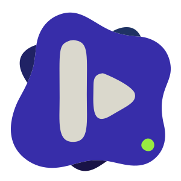
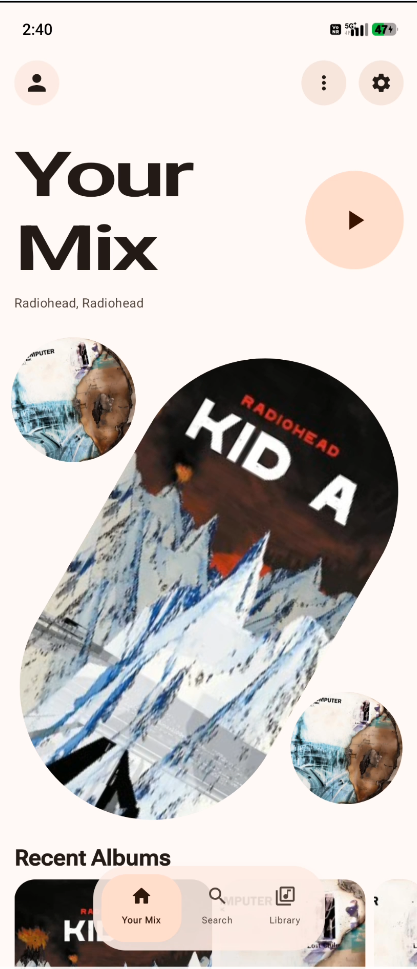
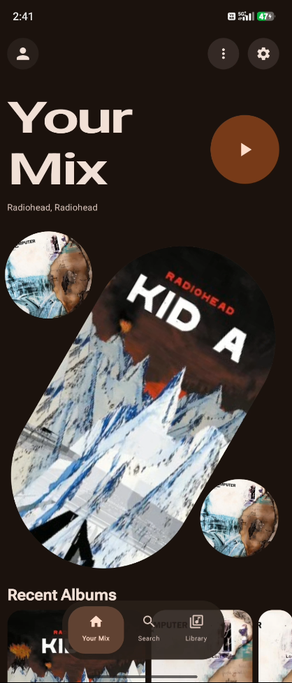
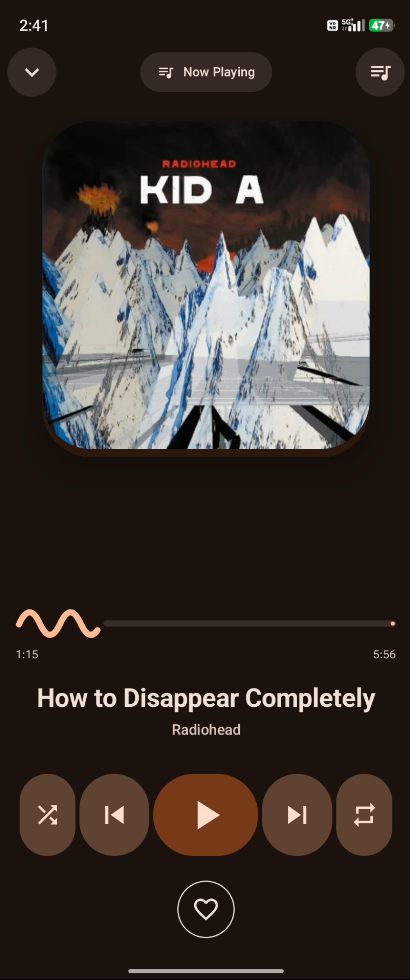

<p align="center">
  
</p>

<h1 align="center">Koda</h1>

<p align="center">
  <b>A modern, feature-rich Android music & video player powered by YouTube Music</b>
</p>

<p align="center">
  
  
  
  
</p>

<p align="center">
  
  
</p>

---

Built entirely with **Kotlin** and **Jetpack Compose**, Koda delivers a premium music and video experience with **Material 3 Expressive** design. Stream music, watch videos, and enjoy personalized recommendations—all without requiring official API keys.

## Screenshots

### Core Screens

<table>
  <tr>
    <td align="center"><b>Home - Light</b></td>
    <td align="center"><b>Home - Dark</b></td>
  </tr>
  <tr>
    <td></td>
    <td></td>
  </tr>
  <tr>
    <td align="center"><b>Search - Light</b></td>
    <td align="center"><b>Search - Dark</b></td>
  </tr>
  <tr>
    <td></td>
    <td></td>
  </tr>
  <tr>
    <td align="center"><b>Library - Light</b></td>
    <td align="center"><b>Library - Dark</b></td>
  </tr>
  <tr>
    <td></td>
    <td></td>
  </tr>
  <tr>
    <td align="center"><b>Settings - Light</b></td>
    <td align="center"><b>Settings - Dark</b></td>
  </tr>
  <tr>
    <td></td>
    <td></td>
  </tr>
</table>

### Music Player

<table>
  <tr>
    <td align="center"><b>Now Playing - Light</b></td>
    <td align="center"><b>Now Playing - Dark</b></td>
  </tr>
  <tr>
    <td></td>
    <td></td>
  </tr>
  <tr>
    <td align="center"><b>Gesture Player - Light</b></td>
    <td align="center"><b>Gesture Player - Dark</b></td>
  </tr>
  <tr>
    <td></td>
    <td></td>
  </tr>
  <tr>
    <td align="center"><b>Queue - Light</b></td>
    <td align="center"><b>Queue - Dark</b></td>
  </tr>
  <tr>
    <td></td>
    <td></td>
  </tr>
  <tr>
    <td align="center"><b>Lyrics - Light</b></td>
    <td align="center"><b>Lyrics - Dark</b></td>
  </tr>
  <tr>
    <td></td>
    <td></td>
  </tr>
</table>

### Video Player

<table>
  <tr>
    <td align="center"><b>Video Player - Light</b></td>
    <td align="center"><b>Video Player - Dark</b></td>
  </tr>
  <tr>
    <td></td>
    <td></td>
  </tr>
  <tr>
    <td align="center"><b>Video Home - Light</b></td>
    <td align="center"><b>Video Home - Dark</b></td>
  </tr>
  <tr>
    <td></td>
    <td></td>
  </tr>
  <tr>
    <td align="center"><b>Mini Video Player</b></td>
    <td align="center"><b>Video History</b></td>
  </tr>
  <tr>
    <td></td>
    <td></td>
  </tr>
</table>

### Downloads & Auth

<table>
  <tr>
    <td align="center"><b>Downloads</b></td>
    <td align="center"><b>YouTube Sign In</b></td>
  </tr>
  <tr>
    <td></td>
    <td></td>
  </tr>
</table>

---

## Features

### YouTube Music Integration
- **Search** — Find songs, albums, artists, and playlists from the YouTube Music catalog
- **Personalized Recommendations** — Quick picks and curated suggestions based on your history
- **Playlist Access** — Browse and play your playlists including "Liked Songs" and "Supermix"
- **History Sync** — Tracks you play sync with your YouTube Music history
- **Like/Unlike** — Heart your favorite songs directly from the player

### Video Player (NEW!)
- **In-App Video Playback** — Watch music videos without leaving the app
- **Picture-in-Picture** — Continue watching in a floating window
- **Quality Selection** — Choose from available qualities (1080p, 720p, etc.)
- **Mini Player** — Collapse to a mini bar while browsing
- **Related Videos** — Discover more content with smart recommendations
- **Auto-Play** — Seamlessly play the next video

### Playback
- **High-Quality Streaming** — Optimized audio via NewPipe Extractor
- **Queue Management** — Full queue control with drag-to-reorder
- **Shuffle & Repeat** — Standard playback modes (off, one, all)
- **Media Session** — System-wide controls via notification & lock screen
- **Local Music Support** — Optional playback of local audio files

### Downloads (NEW!)
- **Download Songs** — Save tracks for offline listening
- **Download Playlists** — Batch download entire playlists
- **Download Manager** — Track progress and manage downloads

### User Interface
- **Material 3 Expressive** — Shape morphing, spring physics, dynamic colors
- **Dynamic Theming** — Album artwork influences the color palette
- **Light, Dark & System** — Choose your preferred theme
- **Gesture-Based Navigation** — Intuitive swipe controls
- **Animated Transitions** — Smooth, physics-based animations

### Library
- **YouTube Playlists** — Access all your saved playlists with cover art
- **Liked Songs** — Dedicated section for hearted tracks
- **Quick Access Cards** — Fast navigation to frequent sections

### Authentication
- **Cookie-Based Auth** — Sign in via embedded WebView
- **Secure Storage** — Credentials stored with EncryptedSharedPreferences

---

## Technical Stack

| Component | Technology |
|-----------|------------|
| Language | Kotlin |
| UI Framework | Jetpack Compose |
| Architecture | MVVM with StateFlow |
| Playback | Media3 ExoPlayer |
| Networking | OkHttp |
| Data Extraction | NewPipe Extractor |
| Image Loading | Coil |
| Concurrency | Kotlin Coroutines & Flow |
| Min SDK | 31 (Android 12) |
| Target SDK | 36 |

---

## Project Structure

```
app/src/main/java/com/ivor/ivormusic/
├── data/                    # Data layer
│   ├── YouTubeRepository    # YouTube Music API via NewPipe
│   ├── DownloadRepository   # Download management
│   ├── SessionManager       # Auth & cookies
│   └── Models               # Song, Playlist, VideoItem
├── service/                 # Background services
│   └── MusicService         # MediaLibraryService
└── ui/                      # Presentation layer
    ├── home/                # Home with recommendations
    ├── library/             # Playlists & liked songs
    ├── player/              # Music player & queue
    ├── video/               # Video player (NEW!)
    ├── search/              # Search functionality
    ├── downloads/           # Download manager (NEW!)
    ├── settings/            # App preferences
    ├── auth/                # YouTube sign-in
    ├── components/          # Reusable UI components
    └── theme/               # Material 3 theming
```

---

## Technical Documentation
For a deep dive into the app's inner workings, internal data flows, and architecture diagrams, see our [Documentation Hub](docs/README.md).

## Getting Started

### Prerequisites
- Android Studio Ladybug or newer
- Android device or emulator (API 31+)

### Installation

1. **Clone the repository**
   ```bash
   git clone https://github.com/Ivorisnoob/Koda.git
   ```

2. **Open in Android Studio**

3. **Sync Gradle** to download dependencies

4. **Run** on your device

### YouTube Account (Optional)

To access personalized features:
1. Navigate to **Settings**
2. Tap **"Connect YouTube Account"**
3. Sign in with your Google account
4. Enjoy personalized recommendations!

---

## Building

### Debug APK
```bash
./gradlew assembleDebug
```

### Release APK
Configure keystore in `app/build.gradle.kts`, then:
```bash
./gradlew assembleRelease
```

APKs are split by ABI for optimized sizes:
- `armeabi-v7a` — 32-bit ARM
- `arm64-v8a` — 64-bit ARM

---

## Roadmap

- [x] Enhanced Playlist Management — Create & edit playlists
- [ ] Advanced Audio — Equalizer, gapless playback, crossfade
- [x] Lyrics Support — Display synced lyrics
- [ ] Widget — Home screen music controls
- [ ] Kotlin Multiplatform — Desktop & iOS support

---

## Contributing

Contributions are welcome! Whether it's reporting a bug, suggesting a new feature, or submitting a pull request, your help is appreciated.

Please see our [CONTRIBUTING.md](CONTRIBUTING.md) for guidelines on how to get started.

---


## License

**Creative Commons Attribution-NonCommercial 4.0 International (CC BY-NC 4.0)**

You are free to:
- **Share** — Copy and redistribute in any medium
- **Adapt** — Remix, transform, and build upon

Under the terms:
- **Attribution** — Give appropriate credit
- **NonCommercial** — No commercial use

See the [LICENSE](LICENSE) file or visit [creativecommons.org/licenses/by-nc/4.0](https://creativecommons.org/licenses/by-nc/4.0/)

---

<p align="center">
  Made with love by <b>ivorisnoob</b>
  <br/>
  Copyright 2026
</p>
