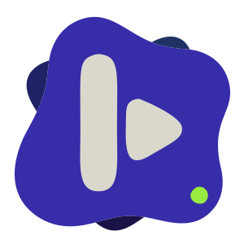

<p align="center">
  
</p>

<h1 align="center">Koda</h1>

<p align="center">
  <b>A modern Android music and video player powered by YouTube Music</b>
</p>

<p align="center">
  
  
  
  
</p>

<p align="center">
  <a href="https://telegram.me/ivorisnoob_chat"></a>
</p>

<p align="center">
  
  
</p>

---

Koda is built entirely with Kotlin and Jetpack Compose, and it is built **ground-up on Material 3 Expressive** — not themed with it, constructed from it. Shapes, motion, color, and typography all resolve through a single `MaterialExpressiveTheme` at the root of the app, and every screen is composed from Expressive primitives. See [DESIGN.md](DESIGN.md) for how that works and why the design is not a swappable layer.

It streams music and video from YouTube, learns what you like, and does it without any official API keys. Everything runs through NewPipe Extractor and direct InnerTube calls.

There is one app with two modes. Leave the video toggle off and Koda is a full music player with a queue, downloads, playlists, statistics, and a library. Turn it on and the Home, Search, and Library tabs reshape into a proper video experience with a personalized feed, a real player, chapters, captions, comments, subscriptions, and notifications. No Google API key is ever required, and the whole app works — search, streaming, downloads, a local taste profile — even without signing in.

## Features

### Music

- **Full YouTube Music search** for songs, albums, artists, and playlists, with results grouped into tabs.
- **Search history** kept locally, with per-item removal and a clear-all action.
- **Personalized quick picks and recommendations**. A local taste profile is built from your play history, liked songs, and recent searches, so suggestions work even when you are logged out. Signed in, they blend in your real YouTube Music home feed.
- **Recently played** rail on Home that stays fresh across the app.
- **Your playlists**, including Liked Songs, plus artist and album pages with play, shuffle, and start-radio actions.
- **Start radio** from any track to spin up an endless, related-song queue.
- **Local playlists** you own: create, rename, edit, drag to reorder, and delete, with auto-generated cover art.
- **Add to playlist** and **add to queue** sheets reachable from the player and lists.
- **Like tracks straight from the player.** Liked songs appear immediately and are stored locally, no login required.
- **Sleep timer** with a live countdown, available from both the mini player and the full player sheet.
- **Synced lyrics** fetched from LRCLIB, scrolling in time with playback.
- **Listening statistics**: songs played, artists explored, liked-song count, top artist, top songs and artists, daily / weekly / monthly play charts, a listening streak, and recent searches.
- **Local audio playback** with MediaStore scanning, per-folder exclusion, and a high-compatibility scan mode for devices where MediaStore misses files.
- **Last-played song restoration** so the player comes back where you left it.

### Player styles

Eight distinct, fully animated player UIs, switchable from a spinnable style wheel:

- **Classic** — familiar transport with play / pause / next / previous.
- **Gesture** — swipeable carousel you flick between tracks.
- **Editorial** — two-tone magazine layout with die-cut art and a word-pill transport.
- **Canvas** — full-bleed album art as the whole screen, with chrome that fades away while playing and swipe-to-skip that follows your finger.
- **Bento** — a squish grid of flat tonal tiles with press physics.
- **Sticker** — a die-cut sticker with drag, peel, and squash-and-stretch physics.
- **Morph** — a living hero shape that cycles organic cuts while playing.
- **Dial** — a rotary tick-ring instrument you spin to scrub.

Plus an **ambient artwork background**, an optional **chromatic-mist** effect, and an option to color the expanded player's controls straight from the current cover art.

### Video mode

- **Personalized video home feed**. It shows your real YouTube feed when you are signed in, and falls back to a taste-based feed built from your watch history when you are not.
- **A real video player** with the full quality ladder up to 2160p60 and a separate audio track, so it never gets stuck on a low muxed quality. A **Default Video Quality** setting picks the starting resolution.
- **Chapters** rendered as seek-bar ticks, a current-chapter chip, and a chapters sheet.
- **Captions / subtitles** with a CC toggle and a language picker, sideloaded as WebVTT and rendered over the video.
- **Double-tap** either side to skip forward or back, and **hold to play at 2x**, with an adjustable playback speed.
- **Picture-in-Picture** that captures just the video, not the whole app.
- **Optional timed comments** that fade in over the video as playback reaches the moment they mention.
- **Share** a video, playlist, or album out to any app.
- **A Subscriptions tab** with the latest uploads from channels you follow, a channel-avatar rail, a full channel list, and drill-in to any channel's uploads.
- **A dedicated watch-history tab** that syncs your viewing back to YouTube.
- **A notification inbox** on the video home screen.
- **Video playlists** and a save-to-playlist sheet, including Watch Later and Liked videos.
- **A mini video player** so a clip keeps playing while you browse.

### Live streams

- **Live streams play like any other video**, with a LIVE badge and a viewer count that keeps updating while you watch.
- **Live chat**, with Super Chats and Super Stickers in their real colors, membership and gift events, pinned messages, channel emoji, and owner / moderator / member badges. Scroll back to read and it holds position instead of yanking you forward; a pill tells you how many you missed.
- **Send messages** when you are signed in. Yours appears instantly, and if the stream rejects it — slow mode, a word filter, a ban — you get told and your text is handed back rather than silently swallowed.
- **Jump back to the live edge** with one tap on the LIVE chip whenever you have fallen behind on a stream with a DVR window.
- **Switching quality is instant.** Every resolution lives in one manifest, so changing it never re-buffers or drops the stream.
- **Vertical live streams get a player built for them.** A 9:16 broadcast fills the screen instead of sitting as a thin strip between two black bars, with chat over the bottom of the video on a soft gradient so it stays readable without hiding the stream. One tap drops to the normal page for the description and related videos, and one tap goes back.
- **Rotate a vertical stream to landscape** and the video moves aside for a full-height chat column — the space next to a 9:16 video is exactly chat-shaped, so nothing is wasted.
- **Comments step aside on live videos**, because live chat is where the conversation actually is.

### Shorts (opt-in)

- A short-form vertical feed, off by default and only shown once you deliberately enable it.
- Swipe-through pager player with prefetch for instant next-video playback.
- An action rail for like, dislike, comments, and share — and you can hide any of those buttons you do not want.

### Comments and engagement

- Read and write comments and replies right from the player. Yours appear instantly.
- Like a comment, and delete your own.
- Like, dislike, and subscribe from the player using your account.

### Playback engine

- High-quality audio streaming via NewPipe Extractor and direct InnerTube resolution (ANDROID_VR / IOS clients for unciphered stream URLs).
- Background playback with system controls on the notification and lock screen through a Media3 media session, including a live progress bar in the notification.
- On Android 16, an optional **Live Update** that puts the current song in the status bar as a chip with a progress bar and the time remaining. Off by default, switchable on in Settings.
- Full queue control with drag to reorder, shuffle, and repeat modes.
- Auto-load queue that appends recommended songs when the queue runs low.
- Crossfade between songs with an adjustable duration.
- Stream prefetch and an on-device cache with a configurable size limit and a one-tap clear.
- OEM and HyperOS fixes: high-compatibility scanning and a battery-optimization opt-out to keep background playback alive on aggressive devices.

### Downloads

- **Download songs and videos** for offline playback. Video is stitched back together from YouTube's separate high-quality video and audio streams into a single MP4, so downloads are not stuck at the 360p that comes as a ready-made file.
- **Download a whole album or playlist** in one tap. Anything you already have is skipped, so re-running it only fetches what is missing.
- **Files go where you can find them** — `Downloads/Koda/Music` and `Downloads/Koda/Video` — named after the track, not the video id. They show up in the Files app and play in anything else on your device.
- **Downloads survive leaving the screen.** They run in the background through a foreground service instead of dying when you navigate away.
- **A download manager** with separate Music and Video tabs, a live queue, progress, cancel, delete, and one-tap retry on anything that failed.
- **Progress notifications with album art**, and on Android 16 an optional **Live Update** that puts download progress in the status bar as a chip with a progress bar. On by default there, switchable off in Settings.
- Failures retry automatically with a freshly resolved stream URL, and a partial download is never left behind as a broken file.

### Interface and theming

Koda's interface is the product, not a wrapper around one. The whole app is constructed from Material 3 Expressive: 39 source files use Expressive-only APIs directly, `MaterialShapes` is referenced 131 times across 14 shapes, and spring physics drives 97 animation specs. There is no alternate design language and no fallback path — details and rationale in [DESIGN.md](DESIGN.md).

- Material 3 Expressive design with shape morphing, spring physics, and dynamic color, applied through one root `MaterialExpressiveTheme`.
- Dynamic theming that pulls its palette from your wallpaper (Android 12+) or from album artwork.
- Over two dozen curated color palettes across six families — Vibrant, Pastel, Aesthetic, Earthy, Moody, and Jewel & Mono.
- Light, dark, and system themes, plus an AMOLED true-black mode.
- Gesture-based navigation and physics-based transitions with a floating pill nav bar.
- A one-tap Home mode toggle to switch between music and video.
- A rebuilt onboarding flow with a morphing shape hero, wavy progress indicator, and focused first-run steps.
- A built-in updater that checks GitHub Releases, picks the right APK for your device's ABI, and installs it.

### Authentication

- Sign in through an embedded WebView. No password ever leaves the browser.
- **Or paste a session cookie** from a desktop browser, for when the in-app sign-in fails or a session has gone stale. The sheet walks through getting it and checks what you paste before saving.
- Cookies are stored with EncryptedSharedPreferences and signed per-origin (SAPISIDHASH).
- Everything except personalized feeds, watch history, comments, and engagement works fully signed out.

---

## Technical Stack

| Component | Technology |
|-----------|------------|
| Language | Kotlin |
| UI Framework | Jetpack Compose |
| Design | Material 3 Expressive |
| Architecture | MVVM with StateFlow (no DI framework) |
| Playback | Media3 ExoPlayer / MediaLibraryService |
| Networking | OkHttp |
| Data Extraction | NewPipe Extractor and direct InnerTube |
| Image Loading | Coil |
| Concurrency | Kotlin Coroutines and Flow |
| Min SDK | 30 (Android 11) |
| Target SDK | 36 |
| Version | 4.3 |

---

## Project Structure

```
app/src/main/java/com/ivor/ivormusic/
├── data/                    # Data layer
│   ├── YouTubeRepository    # YouTube Music and video via NewPipe and InnerTube
│   ├── DownloadRepository   # Download queue, state, and progress
│   ├── DownloadStorage      # Writes downloads into Downloads/Koda via MediaStore
│   ├── DownloadMuxer        # Joins separate video and audio tracks into one MP4
│   ├── DownloadMigration    # One-time move of older downloads to shared storage
│   ├── PlaylistRepository   # Local user playlists
│   ├── LikedSongsRepository # Local liked songs
│   ├── RecommendationEngine # Local taste profile and queue continuation
│   ├── StatsRepository      # Listening statistics
│   ├── LyricsRepository     # Synced lyrics (LRCLIB)
│   ├── UpdateRepository     # In-app updates from GitHub Releases
│   ├── SessionManager       # Auth and cookies
│   ├── ThemePreferences     # All app settings
│   └── Models               # Song, Playlist, VideoItem, SubscriptionItem, ...
├── service/                 # Background services
│   ├── MusicService         # MediaLibraryService with live-progress notification
│   └── DownloadService      # Keeps downloads running in the background
└── ui/                      # Presentation layer
    ├── home/                # Home with recommendations and video feed
    ├── library/             # Playlists, liked songs, statistics
    ├── player/              # Music player, queue, and the eight player styles
    ├── video/               # Video player, live streams and chat, comments, subscriptions
    ├── shorts/              # Opt-in Shorts player
    ├── search/              # Search and video explore
    ├── artist/              # Artist and album pages
    ├── downloads/           # Download manager
    ├── settings/            # App preferences and updates
    ├── auth/                # YouTube sign in
    ├── onboarding/          # First run flow
    ├── components/          # Reusable UI components
    └── theme/               # Material 3 theming and color palettes
```

---

## Getting Started

### Prerequisites

- Android Studio Ladybug or newer
- An Android device or emulator running API 30 (Android 11) or higher

On Android 11, wallpaper-based dynamic color is unavailable — that is an Android 12 platform feature — so Koda falls back to its bundled palettes. Everything else (playback, downloads, video, sign-in) works the same.

### Installation

1. Clone the repository
   ```bash
   git clone https://github.com/Ivorisnoob/Koda.git
   ```
2. Open it in Android Studio.
3. Sync Gradle to download dependencies.
4. Run it on your device.

### YouTube account (optional)

Personalized feeds, watch history, comments, and engagement need a signed-in account. To connect one, open Settings, tap Connect YouTube Account, and sign in with Google. Koda works without an account too, using a local taste profile for recommendations.

---

## Building

### Debug APK

```bash
./gradlew assembleDebug
```

### Release APK

Configure the keystore in `app/build.gradle.kts` (or the `KEYSTORE_PASSWORD` / `KEY_ALIAS` / `KEY_PASSWORD` env vars), then:

```bash
./gradlew assembleRelease
```

APKs are split by ABI for smaller downloads:

- `armeabi-v7a` for 32-bit ARM
- `arm64-v8a` for 64-bit ARM
- a universal APK containing both

For a deeper dive into the architecture, data flows, and the InnerTube layer, see [`CLAUDE.md`](CLAUDE.md). For the design system — shape, motion, color, and the rules for contributing UI code — see [`DESIGN.md`](DESIGN.md).

---

## Roadmap

- [x] Playlist management, create and edit playlists
- [x] Lyrics support with synced display
- [x] In-app video with a personalized feed, chapters, and captions
- [x] Multiple player styles and a full color-palette system
- [x] Listening statistics
- [x] Offline downloads for music and video, saved to your Downloads folder
- [x] Live streams with live chat, including a full-screen player for vertical broadcasts
- [ ] Advanced audio: equalizer and gapless playback
- [ ] Home screen widget for playback controls
- [ ] Kotlin Multiplatform for desktop and iOS

---

## Community

Join the Telegram chat at **[t.me/ivorisnoob_chat](https://t.me/ivorisnoob_chat)** for beta builds, help with a problem, and feature discussion. Bug reports and feature requests are still best filed as [GitHub issues](https://github.com/Ivorisnoob/Koda/issues) so they do not get lost.

---

## Contributing

Contributions are welcome, whether it is a bug report, a feature idea, or a pull request. See [CONTRIBUTING.md](CONTRIBUTING.md) to get started.

---

## License

GNU GPL V3

See the [LICENSE](LICENSE) file.

---

<p align="center">
  Made by <b>ivorisnoob</b>
  <br/>
  Copyright 2026
</p>
