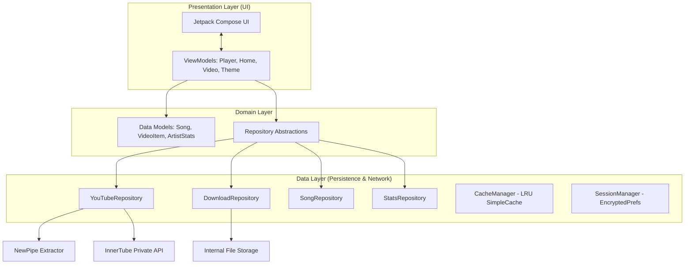
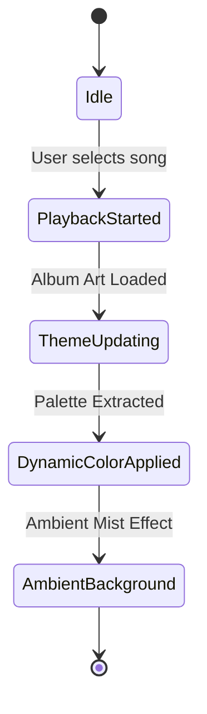
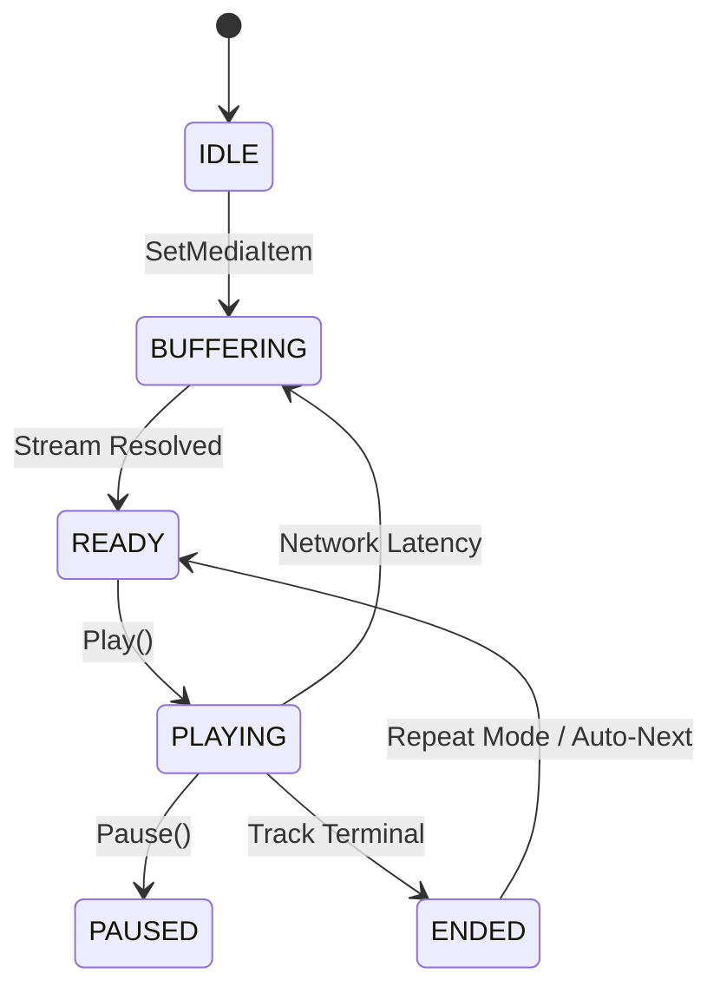

# Technical Architecture

This document provides a comprehensive technical breakdown of The Music App's architecture, data flow, and core systems. It is designed for developers and contributors seeking specialized knowledge of the application's inner workings.

## System Architecture

The application implements a robust **MVVM (Model-View-ViewModel)** architecture enhanced by **Reactive Streams (StateFlow)** and **Dependency Injection** (manual). It adheres to Clean Architecture principles by separating the Presentation, Domain, and Data layers.

---

## Core System Deep-Dives

### 1. The Engine: `MusicService`
The playback backbone is a `MediaLibraryService` (Media3/ExoPlayer). It operates as a foreground service to maintain playback continuity.

-   **Just-In-Time Resolution**: Queue items are initially lightweight placeholders (custom URI scheme: `ivormusic://placeholder`). The service intercepts playback requests, fetches the actual stream URL via `YouTubeRepository`, and swaps the URI before the buffer depletes.
-   **Deduplicated Resolution**: Uses `ConcurrentHashMap<String, Deferred<MediaItem>>` to ensure that simultaneous prefetching and playback requests for the same track do not trigger duplicate network calls.
-   **Adaptive Prefetching**: Actively resolves the next 3 items in the queue. This is managed via the `onMediaItemTransition` callback and a custom `resolveScope` (CoroutineScope).

### 2. Data Acquisition: `YouTubeRepository`
A hybrid extraction layer that circumvents official API limitations while maintaining personalized features.

-   **NewPipe Extraction**: Parses YouTube's public frontend for search, album metadata, and stream URLs.
-   **InnerTube API Integration**: For authenticated features (Recommendations, History, Liked Music), the repo uses internal API keys (`INNER_TUBE_API_KEY`) and session cookies.
-   **Fallback Mechanics**: If NewPipe extraction fails (e.g., "Page needs to be reloaded" bot-check), the repository falls back to the `ANDROID` client signature of the InnerTube API, which utilizes a more resilient player signature.

### 3. Storage & Infrastructure
-   **`CacheManager`**: Manages a Media3 `SimpleCache` with a Least Recently Used (LRU) eviction policy. Max size is configurable up to 4GB.
-   **`SessionManager`**: Securely persists YouTube cookies using **Jetpack Security (EncryptedSharedPreferences)**. This ensures that session tokens are hardware-backed and encrypted at rest.
-   **`PlaylistRepository`**: Manages local playlists stored as serialized JSON. It includes a custom `Canvas` drawing engine that generates unique gradient cover art for each playlist.

---

## Theming & Design System

The app utilizes **Material 3 Expressive**, a specialized subset of M3 focusing on dynamic motion and organic shapes.

-   **Motion Scheme**: Uses spring-based physics for transitions (Expandable Player, Navigation).
-   **Shape System**: Implements a custom `ExpressiveShapes` palette with high-curvature RoundedCornerShapes (up to 36dp) for a premium, organic feel.
-   **Dynamic Theming**: On Android 12+, utilized `dynamicDarkColorScheme`. On older versions, it falls back to a curated `DarkColorScheme` with a custom surface variant palette.

---

## Advanced Integrations

### Android 16 Live Updates
The app is future-proofed for Android 16 Live Updates (Live Activities).
-   **`MusicProgressLiveUpdate`**: A dedicated manager that uses reflection to access API 36+ features (`setRequestPromotedOngoing`, `setShortCriticalText`).
-   **`LiveUpdateMediaNotificationProvider`**: Extends `DefaultMediaNotificationProvider` to inject the promoted ongoing flag into basic Media3 notifications.

### Playback State Diagram

---

## Security Model
1.  **Authentication**: Zero-knowledge cookie handling. Cookies are passed directly to `YouTubei` endpoints with signed `SAPISIDHASH` headers.
2.  **Encryption**: MasterKey-backed encryption for user identity data.
3.  **Local Isolation**: Downloads and playlists are stored in `context.filesDir`, preventing other apps from accessing the media library without explicit permission.
