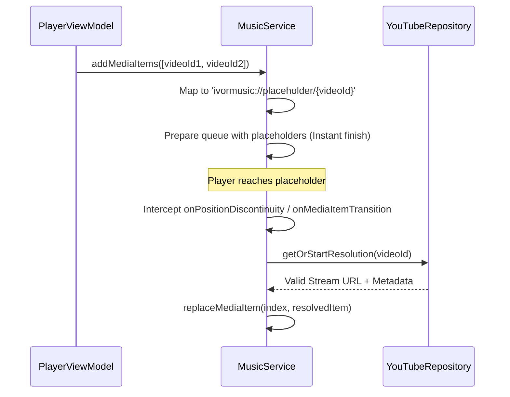

# Deep Dive: Playback Engine

This document details the audio playback architecture of The Music App, centered around the integration of Media3 ExoPlayer and a custom background service.

## Core Component: `MusicService`

`MusicService` is a `MediaLibraryService` that manages the lifecycle of the `ExoPlayer` instance. It handles foreground service status, notifications, and integration with external controllers (Android Auto, Bluetooth, Wear OS).

### 1. ExoPlayer Configuration

The player is initialized with specialized components to handle high-latency network streams:

-   **`LoadControl`**: Uses a `DefaultLoadControl` with an increased buffer (up to 50 seconds) and higher `bufferForPlaybackMs` (2500ms) to prevent stuttering on unstable connections.
-   **`RenderersFactory`**: Uses `DefaultRenderersFactory` with extension modes enabled.
-   **`CacheDataSource`**: Wraps the upstream `DefaultHttpDataSource` with `CacheManager.getCache()`, allowing transparent multi-layer caching.

### 2. Just-In-Time Media Resolution

The app utilizes a deferred resolution strategy to maintain a responsive UI.

#### Deduplication Mechanism
To prevent redundant network calls when the system and user actions overlap, `MusicService` maintains an `activeResolutions` map:
`private val activeResolutions = ConcurrentHashMap<String, Deferred<MediaItem>>()`
This ensures that if a song is requested by both the prefetcher and the active player, they await the same coroutine result.

### 3. Adaptive Prefetching Engine

The service implements a proactive caching strategy:
-   **Trigger**: Whenever a new track starts playing or the queue changes.
-   **Scope**: Resolves the next 3 items in the current timeline.
-   **Operation**: Fetches the stream URL and metadata asynchronously. Once resolved, the placeholder in the player's timeline is replaced with the real URL.
-   **Buffering**: Because the player is already "prepared" with the timeline, ExoPlayer can start buffering the `resolvedItem` in the background before the user reaches it.

### 4. Crossfade & Audio Transitions

The app implements a software-level crossfade using manual volume manipulation, as native ExoPlayer crossfade support is limited for non-gapless streams.

-   **Fade-Out**: Monitored via a `monitorProgress()` loop. When remaining duration matches `crossfadeDurationMs`, the volume is linearly decreased.
-   **Fade-In**: Triggered on `onMediaItemTransition` (reason: `AUTO`). Volume starts at 0.0f and ramps to 1.0f over the set duration.
-   **Safety**: If a user manually skips (`reason: MANUAL`), crossfade is bypassed to ensure instant response.

### 5. Android 16 Live Updates

Integrated via `MusicProgressLiveUpdate`. It utilizes a high-priority `Notification.Builder` with `setRequestPromotedOngoing(true)` to appear in the Android 16 status bar chip. This notification is updated every 1000ms during active playback to synchronize the progress bar and "time remaining" text.

---

## State Management

| State | Source | Frequency |
| :--- | :--- | :--- |
| Playback Progress | `player.currentPosition` | 1000ms (Poll) |
| Buffering State | `player.playbackState` | Reactive (Callback) |
| Audio Session ID | `player.audioSessionId` | Once per session |
| Metadata | `player.currentMediaItem` | On change |
